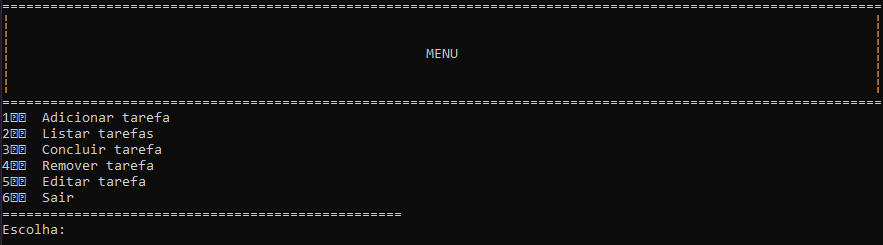
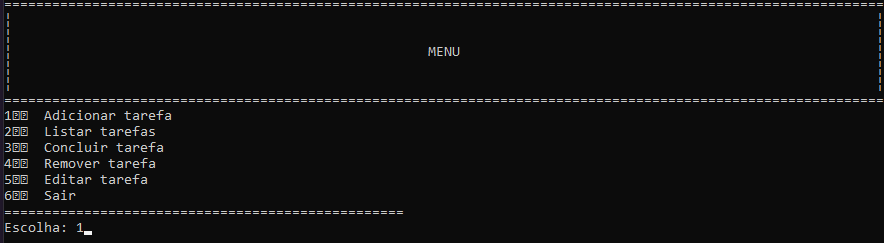
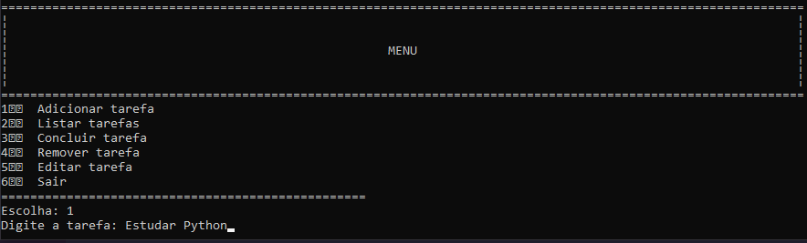
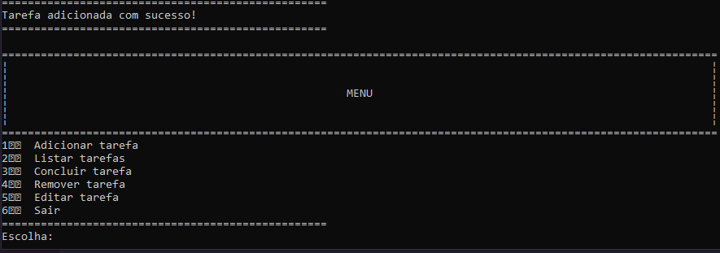

# CLIST - Gerenciador de Tarefas em Linha de Comando

CLIST é uma ferramenta de linha de comando simples e poderosa para criação, organização e visualização de listas de tarefas diretamente no terminal.

## 🚀 Recursos/ Funcionalidaes

- 📋 Criação de tarefas
- ✅ Marcação de tarefas como concluídas
- 🔍 Filtro por status
- 💾 Persistência local em arquivo JSON
- 🖥️ Interface de terminal amigável

## 🏗️ Status do Projeto

✅ Concluído | Pronto para uso

## 🛠️ Como Usar / Instalar

### Pré-requisitos
- Python 3.12+
- pip

### Instalação
```bash
git clone https://github.com/thaynabcosta/clist.git
cd clist
pip install -r requirements.txt
python clist.py
```

## 💡 Exemplos de Uso

### Adicionar Tarefa

Menu inicial


Escolhendo a função adicionar


Digitando nova tarefa


Tarefa adicionada com sucesso! Retorna o menu principal


## 🧱 Tecnologias Utilizadas

- Python 3.12+
- JSON (para armazenamento local)

## 📁 Estrutura de Pastas

clist/  
├── .gitignore  
├── main.py  
├── README.py  
├── storage.py  
├── task_manager.py  
├── tasks.json  
└── utils.py  

## 👩‍💻 Contribuições

Contribuições são bem-vindas! Para isso:
- Faça um fork
- Crie uma branch com sua feature (`git checkout -b feature/xyz`)
- Faça commit das mudanças (`git commit -m 'feat: xyz'`)
- Faça push para a branch (`git push origin feature/xyz`)
- Abra um Pull Request

## 📜 Licença

Este projeto está licenciado sob a [Licença MIT](./LICENSE). © 2025 Bia
